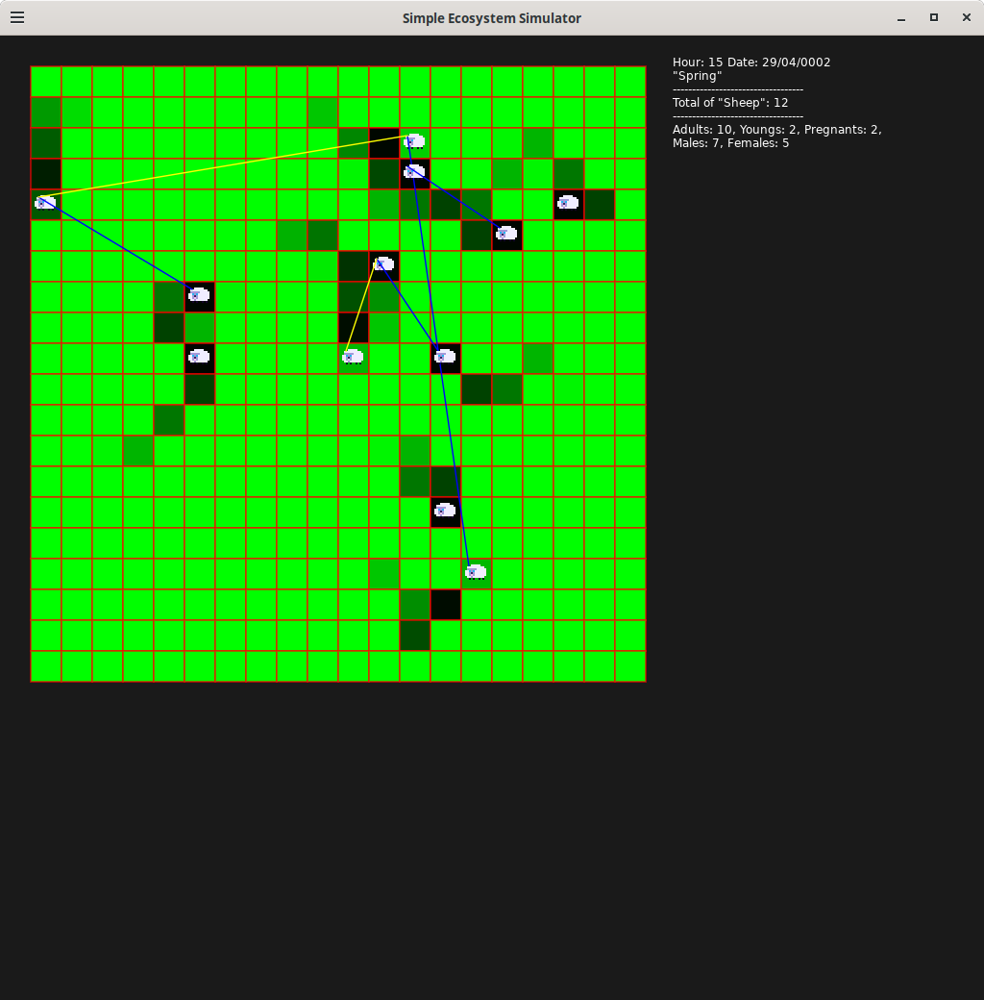

# 🐑 Simple Ecosystem Simulator

A minimalist retro-style ecosystem simulation featuring reproduction, feeding, sleeping, and a day/night cycle.

Developed with [LÖVE2D](https://love2d.org/), this project provides a foundation for experimenting with entity behaviors in an evolving and autonomous environment.

{width=75%}

---

## 🎮 Project Goal

Simulate the life of creatures (sheep) in a tile-based environment (`Tile`), with natural behaviors such as:

- movement toward resources,
- sleep based on circadian rhythm,
- conditional reproduction (age, energy, season…),
- social bonds (following the mother or a partner),
- aging, gestation, and birth.

---

## 🧠 Implemented Mechanics

- **Day/Night cycle** with a global clock (`WorldClock`)
- **Seasons** influencing reproduction
- **Terrain tiles** with grass that grows and can be eaten
- **Sheep (`Sheep`)** featuring:
  - needs (hunger, energy)
  - gender, age, gestation
  - herd behavior (following mother or partner)
  - sleep patterns (diurnal/nocturnal)
- **HUD visualization** of time and population statistics
- **Visible social links** between individuals (colored lines)
- **Behavioral modularity** through directories:
  - `Behavior/`: graze, move, sleep, reproduce, social
  - `Entity/`: world entities (Tile, Sheep)

---

## 🚀 Running the Project

### Requirements

- [LÖVE2D](https://love2d.org/) (version 11.x recommended)

### Launch

<code>love .</code>

## 📌 TODO / TODO / Planned Improvements

- Lifespan and death management
- Introduction of new animals (predators, prey…)
- Simple genetics (trait inheritance)
- Weather system (influence on grass growth)
- Interactive menu + clickable UI
- Data export (statistics, population logs)

## 🧑‍💻 Auteur

Project initiated by Jojopov, as a training ground for simulation design, natural AI logic, and clean Lua code structure.

## 🧾 Licence

GNU GPL3
# SimpleEcosystem
